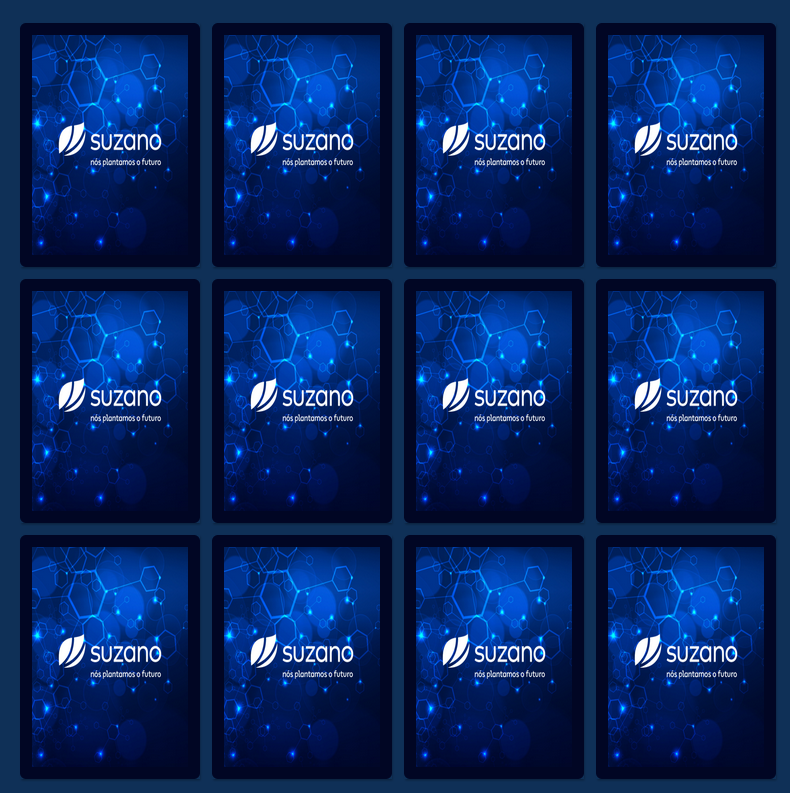
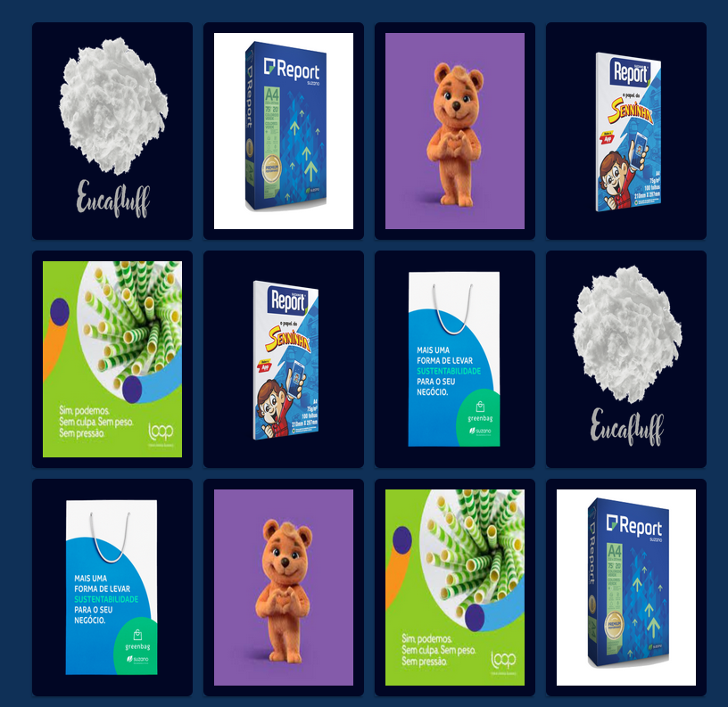
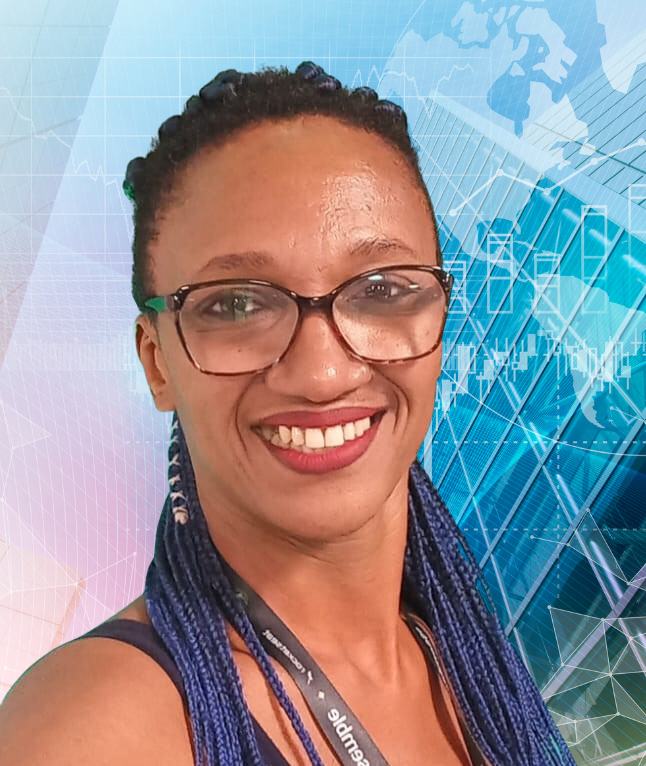

  

<h1  align="center">

</h1> 

## 🔖 Layout

 

## 🚀 Tecnologias Utilizadas 

O projeto foi desenvolvido utilizando as seguintes tecnologias

- HTML5
- CSS3
- Javascript
 
 

## 💻 Desafio

- Faça um Fork do repositório
- Clone o seu repositório
- Corrija os erros
- Atualize o seu repositório
- Publique a aplicação no github pages
- Envie o link no chat do meet

> Continue a resolver a solução até que seja avisado que já existe um ganhador.
 

## 👩‍💼 Autora

<b>Nádia Ligia, back-end developer.</b>

&nbsp;&nbsp;
&nbsp;&nbsp;
&nbsp;&nbsp;